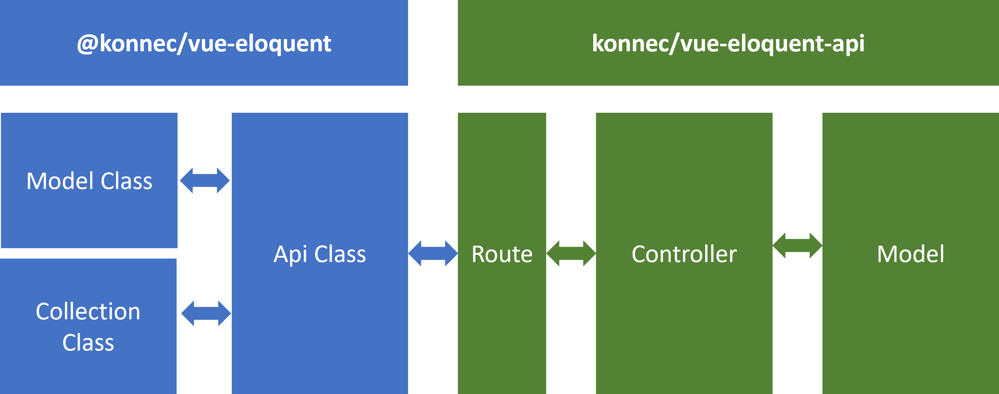

# Getting Started

## Objectives

1. Abstract the business logic out of the Vue pages and into Object Classes
2. Use Laravel known methods into to manage your Vue classes
3. Use JSON API like interface

## Intro

This package comprises two packages:
1. A Vue 3 package:
```js
@konnec/vue-eloquent
```
2. A Laravel package:
```js
konnec/vue-eloquent-api
```

Installation and usage or both packages are described in these docs. They can be used together or individually

## Architecture


